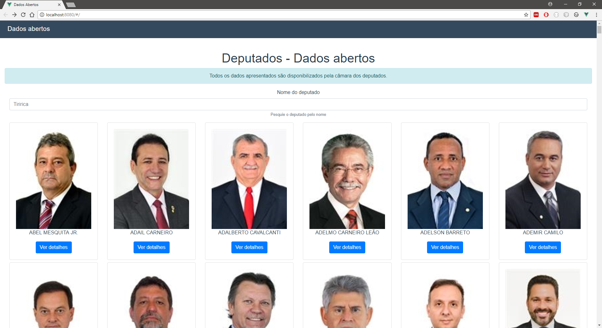
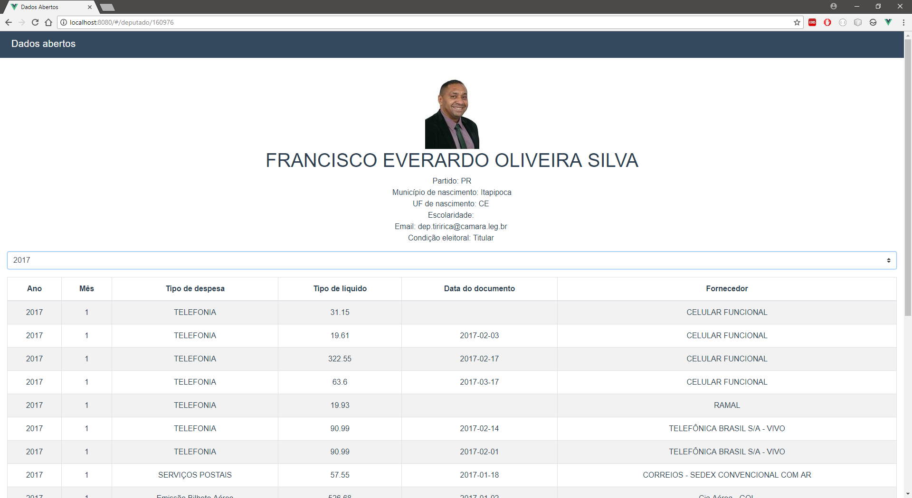

# Dados Abertos - VUE

> Projeto de estudos VueJS com PWA

## Descrição

WebApp para consumo dos dados abertos da câmara dos deputados, disponibilizados em [https://dadosabertos.camara.leg.br/](https://dadosabertos.camara.leg.br/)

## Objetivos

Este projeto possui inicialmente dois objetivos:
- Estudar os aspectos técnicos de desenvolvimento em VueJS + WebPack;
- Apresentar à sociedade um WebApp para melhor análise dos dados abertos disponibilizados pela Câmara dos Deputados.

## Tecnologias

As tecnologias utilizadas atualmente são:
- [VuePWA Template](https://github.com/vuejs-templates/pwa);
- [bootstrap-vue](https://bootstrap-vue.js.org/)
- [vue-chartkick](https://www.chartkick.com/vue)
- [vue-axios](https://www.npmjs.com/package/vue-axios)

## TODO

- Integrar com o JARBAS API do projeto Serenata de Amor. [link](https://github.com/okfn-brasil/serenata-de-amor/blob/master/jarbas/README.md#json-api-endpoints)

## Demonstração

Uma instância do sistema construido inicialmente na pasta /dist foi movida para pasta [/docs](https://github.com/Ermesoml/DadosAbertos-Vue/tree/master/docs) neste repositório, podendo ser acessado através [deste link](https://ermesoml.github.io/DadosAbertos-Vue/).

## Imagens





## Build Setup
``` bash
# Instale dependências
npm install
# Inicie o servidor em modo de desenvolvimento com hot reload em localhost:8080
npm run dev
# Build para produção, com minificação. Cria uma pasta /dist com o site.
npm run build
```
